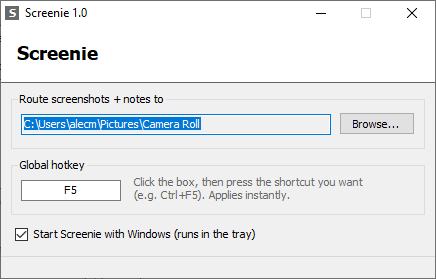

# Screenie

Screenshot + note tool for Claude Code workflows. Global hotkey → region snip → note → paired `snap_*.png` / `snap_*.txt` in a target folder. Windows app + Linux script, same file convention.




## Usage

- `PrtSc` (default, rebindable) — drag to capture. Saves immediately, also copied to clipboard.
- Note prompt: `Enter` save, `Ctrl+Enter` newline, `Esc` skip.
- Output: `snap_YYYYMMDD_HHMMSS.png` + `.txt` in the route folder.

## Claude Code

Route to `.screenie/` in your project (gitignored), add to CLAUDE.md:

```
## Screenie
.screenie/ is an inbox of annotated screenshots: each snap_*.png has a matching
snap_*.txt saying what to do with it. On frontend/UI requests, review pending
pairs first. Delete each pair once handled.
```

## Config

- Route folder: in-app, or tray icon > Route to.
- Hotkey: click the box in-app, press a combo. F1–F12 / A–Z / 0–9 / PrintScreen, with Ctrl/Alt/Shift. If Windows has PrtSc bound to Snipping Tool, turn that off (Settings > Accessibility > Keyboard) or rebind.
- Optional run-at-startup via HKCU Run key (checkbox in-app, off by default).
- Close/minimize → tray. Exit from tray menu.
- `%APPDATA%\Screenie\config.ini`

## Linux

`screenie.sh` — same pairs, no app. Your DE handles the keybind.

- Needs a region tool (`grim`+`slurp`, `maim`, `flameshot`, `gnome-screenshot`, or `spectacle`) and `zenity` or `kdialog` for the note. Clipboard copy if `wl-copy`/`xclip` present.
- `./screenie.sh --set-folder ~/proj/.screenie` — set the route folder (config in `~/.config/screenie/config`).
- Bind `screenie.sh` to PrtSc in your DE's keyboard shortcut settings.
- Note prompt: OK saves, empty or cancel skips.

## Build

`build.bat` — compiles `Screenie.cs` with the csc bundled in Windows, no SDK. Or grab `Screenie.exe` from Releases.

The exe is unsigned, so SmartScreen warns on first run (More info → Run anyway). It's one .cs file — read it and build it yourself if you'd rather.
